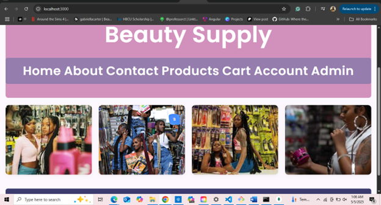
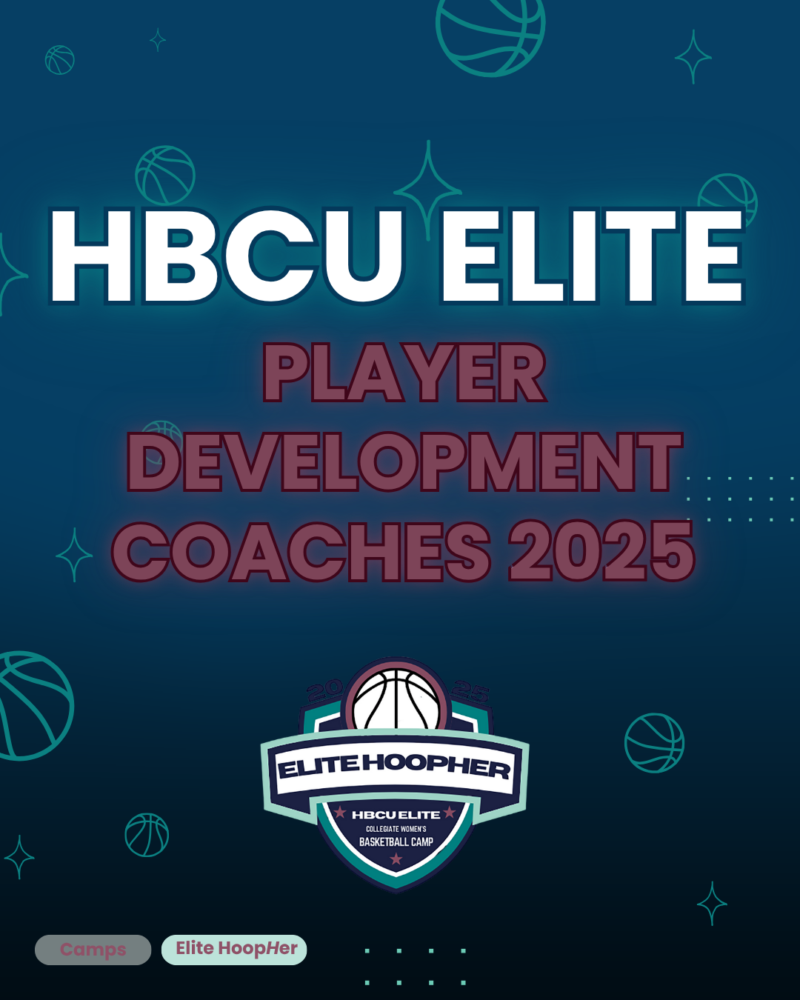
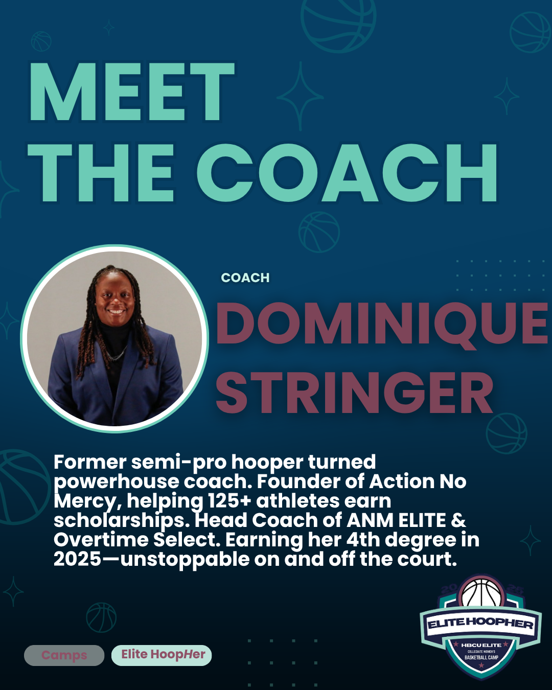
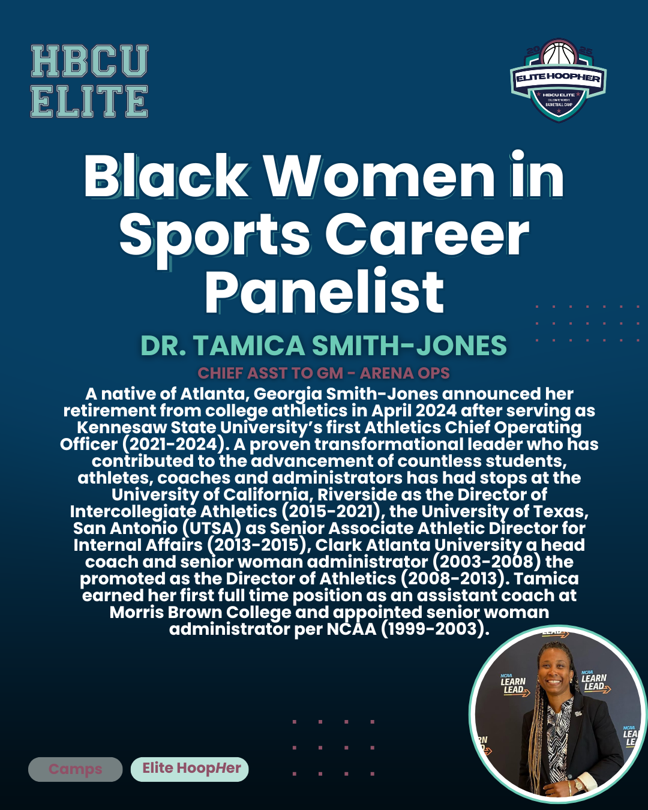

# 👋🏾 Temi’s Portfolio

Hi, I’m Temidayo “Temi” Adeyemo — a creative technologist and recent Computer Science graduate from Clark Atlanta University. I blend tech, design, and community leadership to build meaningful digital experiences. From launching full-stack apps to designing flyers for national events, I lead with purpose and heart.

---

## 💻 Tech Projects

### **Brown Sugar Beauty**
A fully functional e-commerce website built with Node.js, MongoDB, and Firebase Auth. Focused on elegant design and seamless shopping.  
🔗 [View Live Project](https://link-to-your-project.com) | [GitHub Repo](https://github.com/ClarkAtlantaUni/nodejsappspace-Temid4/tree/109c33f8baa9d066088b373cbe964df6814b4406/Final%20Project/BownSugar) | [Screenshots](https://github.com/Temid4/Temid4.github.io/tree/9981bf3dad0fa318e1c3cb581818e247468cbb3d/images/BrownSugarHair)

---

### **Skincare Tracker App**
Mobile app developed in FlutterFlow that tracks skincare routines and offers AI-powered skin analysis. Built with Firebase, Google Cloud, and custom UX logic.  
🛠️ Tools: Firebase, FlutterFlow, Google Cloud  
🔗 [Demo Available Upon Request]

---

## 🎨 Creative Projects

### **HBCU Elite Flyer Designs**
Designed branded social graphics, event flyers, and airport signage for HBCU Elite Hooper Camp under tight deadlines using Canva and Illustrator.  
🖌️ Tools: Canva, Adobe Illustrator, Instagram, Dropbox  

📸 Sample Designs:

🔗 [Browse More Designs](https://github.com/Temid4/Temid4.github.io/tree/main/images/HBCUElite)

---

## 🧠 Leadership Highlights

- **Vice President of CAB (Campus Activities Board)** — Built general membership engagement programs and supported university-wide events.
- **Resident Assistant (RA)** — Managed student check-ins/outs and hosted community-based programs.
- **Admissions Intern** — Marketed the university to prospective students via digital strategies.
- **Mentor & Orientation Guide** — Led onboarding for incoming students across several cohorts.

---

## 🛠️ Skills & Tools

- **Programming:** Python, JavaScript, HTML/CSS  
- **Frameworks & Tools:** Node.js, Express, FlutterFlow, Firebase  
- **Cloud Platforms:** Google Cloud, GitHub  
- **Design:** Canva, Illustrator, Figma, Photoshop  

---

## 🗣️ What People Say

> *“Temi’s creativity and leadership consistently elevated every project she worked on.”*  
> — HBCU Elite Event Director

> *“She leads with compassion and delivers with precision. A true force on campus.”*  
> — CAB Advisor

---

## 📄 Resume & Contact

📫 Connect with me: [LinkedIn](https://www.linkedin.com/in/temidayoadeyemo/) | [Email](mailto:molenopesoluwa@gmail.com)  
📄 [Download My Resume](Files/Temi_Adeyemo_Resume.pdf)

---

###### Hosted on: [Temid4.github.io](https://temid4.github.io)
